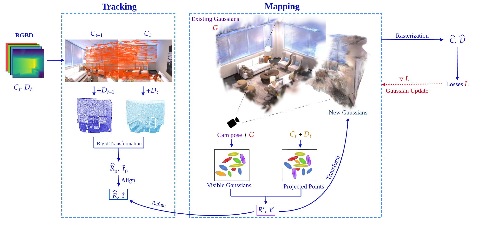

# FlashSLAM: Accelerated RGB-D SLAM for Real-Time 3D Scene Reconstruction with Gaussian Splatting

### Overview

FlashSLAM is a cutting-edge SLAM (Simultaneous Localization and Mapping) system designed to enable efficient and robust 3D scene reconstruction in real-time. By leveraging **3D Gaussian Splatting (3DGS)** and advanced vision-based camera tracking, FlashSLAM overcomes the limitations of existing methods in sparse view settings and during large camera movements. 

Key innovations include:
- **Fast and Accurate Camera Tracking**: Achieves sub-80 ms pose estimation using a pretrained feature matching model and point cloud registration, offering a 90% reduction in tracking time compared to SplaTAM.
- **Robustness to Sensor Noise**: Effectively handles depth errors, enabling reliable performance with consumer-grade devices such as smartphones.
- **Improved Accuracy in Sparse Settings**: Delivers up to a 92% improvement in tracking accuracy under challenging conditions.

This repository includes the codebase, evaluation scripts, and dataset configurations for replicating the results presented in our paper.

---

### Features

- **Real-Time Performance**: Pose estimation under 80 ms per frame, making it suitable for dynamic and large-scale environments.
- **Enhanced Reconstruction Accuracy**: Combines RGB-D input with robust depth handling techniques to produce high-fidelity 3D models.
- **Versatility**: Validated on both synthetic and real-world datasets, demonstrating reliable performance across diverse settings.
- **Compatibility**: Designed to work with standard RGB-D devices, including smartphones and consumer-grade depth sensors.

